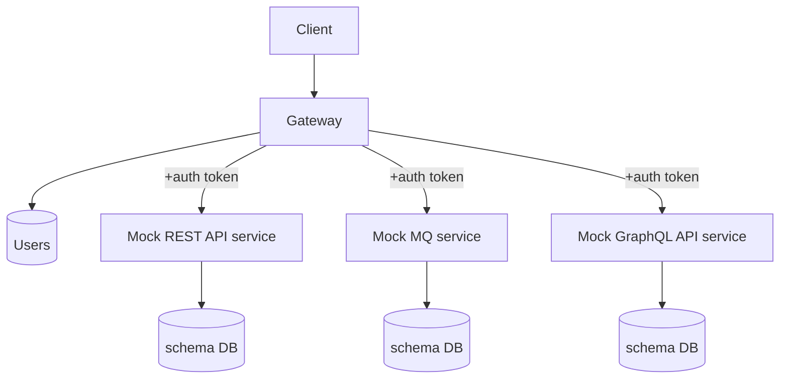

## Backend architecture overview

```mermaid
    flowchart TD
        A[Client] --> B[Gateway]
        B --> Udb[(Users)]
        B -->|+auth token| R[Mock REST API service] --> Rdb[(schema DB)]
        B -->|+auth token| M[Mock MQ service] --> Mdb[(schema DB)]
        B -->|+auth token| G[Mock GraphQL API service] --> Gdb[(schema DB)]
```